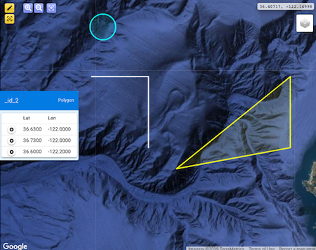

# A Quasar component for geometry viewing and editing

Status: preliminary

> 

# Install
```bash
quasar ext add @mbari/qgeomap
```
Quasar CLI will retrieve the component from NPM and install the extension.

# Uninstall
```bash
quasar ext remove @mbari/qgeomap
```

# Describe
```bash
quasar describe qgeomap
```
